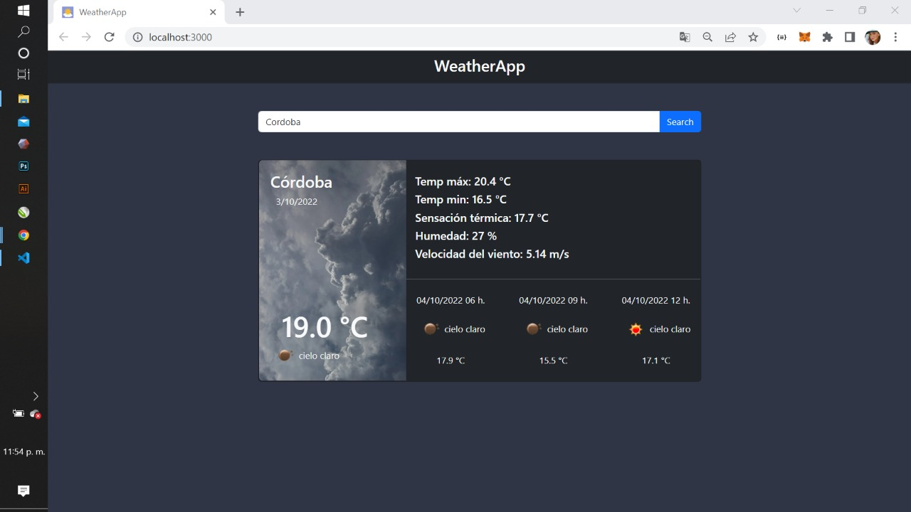

# WeatherApp

This project was bootstrapped with [Create React App](https://github.com/facebook/create-react-app).

### About
Aplicación meteorológica dónde se pueden buscar ciudades y obtener información de las mismas consumiendo la api de [OpenWeatherMap](https://openweathermap.org).
Al buscar la ciudad , en caso de que no exista aparecerá un error de que no hay datos, de lo contrario se mostrará la temperatura actual, máxima y mínima, con la fecha del día, así también la sensación térmica, humedad y velocidad del viento en m/s. 
A su vez cuenta con una predicción del cambio del tiempo con el paso de las horas.

Para aplicarle estilos utilicé Bootstrap.

 

 

 

